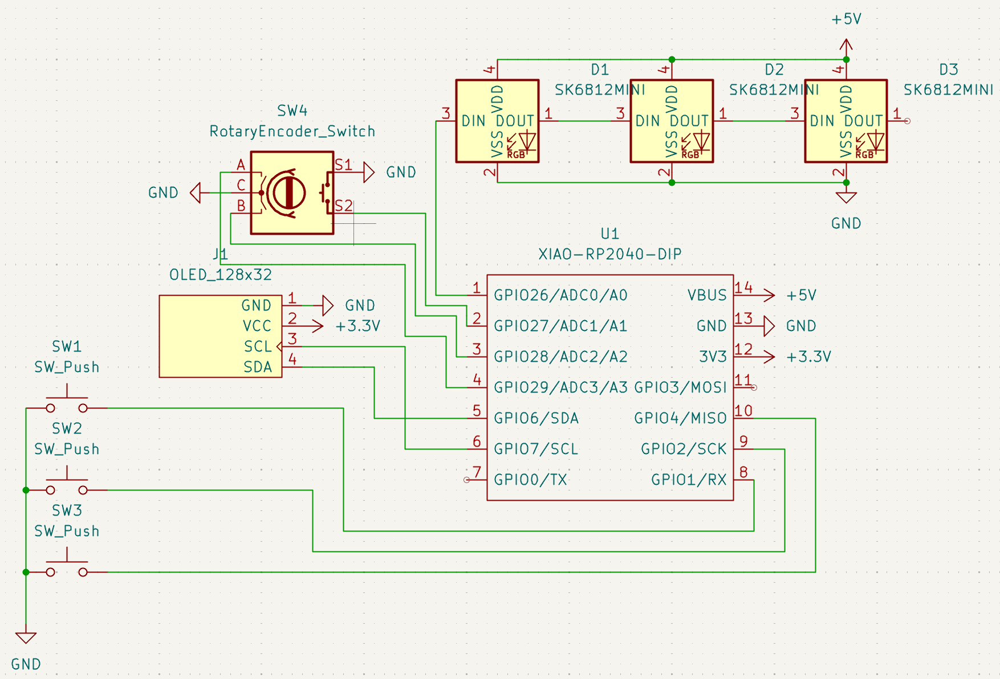

# CopyPad

A custom macropad designed for efficient copy, cut, and paste with an integrated OLED display and rotary encoder for volume control.

## Features

- **3-Key Linear Layout**: Keys for Cut (Ctrl+X), Copy (Ctrl+C), and Paste (Ctrl+V)
- **OLED Display**: 128x32 pixel display showing current status
- **Rotary Encoder**: Volume control with tactile feedback
- **Open Source**: Complete hardware and software design files included

*physical picture available soon*

## Project Structure

```
CopyPad/
├── README.md               
├── cad/                    
│   └── CopyPad_v2.step     
├── firmware/                
│   └── main.py             
├── pcb/                    
│   ├── CopyPad.kicad_pcb   
│   ├── CopyPad.kicad_sch   
│   ├── CopyPad.kicad_pro   
│   ├── CopyPad.kicad_prl   
│   └── library/            
└── production/             
    ├── CopyPad_main.stl    
    ├── CopyPad_top.stl     
    └── gerbers.zip         
```

## Assembly

1. Solder all components according to the schematic
2. Flash `main.py` to the microcontroller
3. 3D print the case files from `production/CopyPad_main.stl` and `production/CopyPad_top.stl`
4. Install the PCB into the case
5. Secure the top case with heatset inserts and screws

## Bill of Materials

| Component | Quantity | Description |
|-----------|----------|-------------|
| PCB | 1 | Manufactured from provided Gerber files |
| Seeed XIAO RP2040 | 1 |  |
| MX-Style switches | 3 |  |
| Keycaps | 3 | X, C, V legends preferred |
| SK6812 MINI-E LEDs | 3 | RGB! |
| 0.91 inch OLED displays  | 1 | GND-VCC-SCL-SDA pin order |
| Rotary Encoder  | 1 | EC11 |
| Encoder Knob | 1 |  |
| Case | 1 | 3D printed from provided STL files |
| Heatset Inserts | 4 | M3x5mx4mm |
| Screws | 4 | M3x16mm |
| Soldering Iron | 1 | For Assembly |


## Pictures




## License

This project is open source and available under the MIT License. See the LICENSE file for more details.
